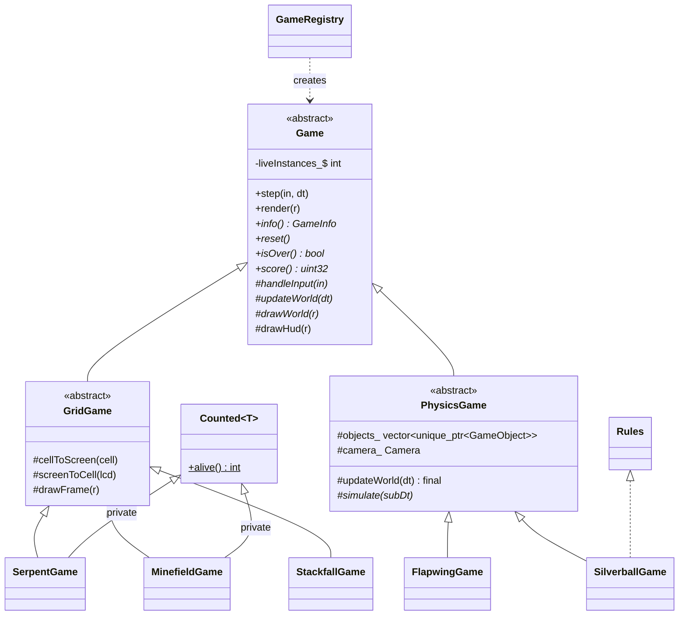
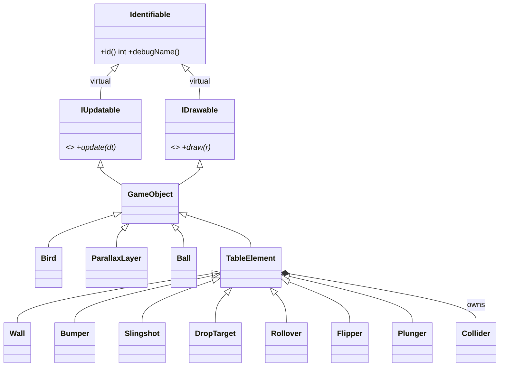
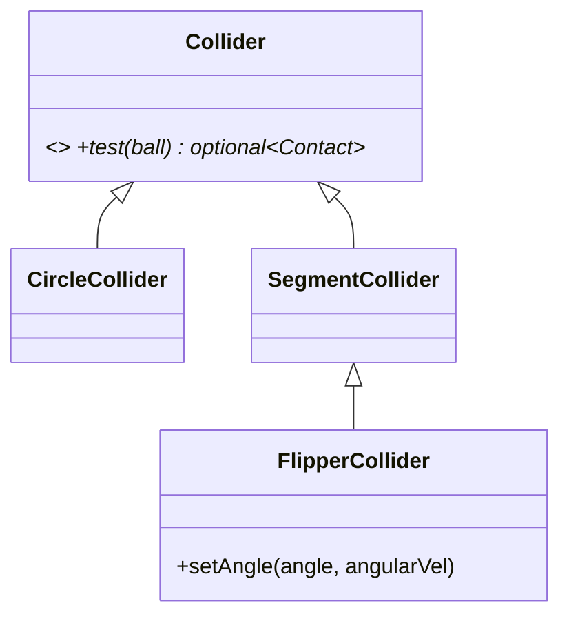
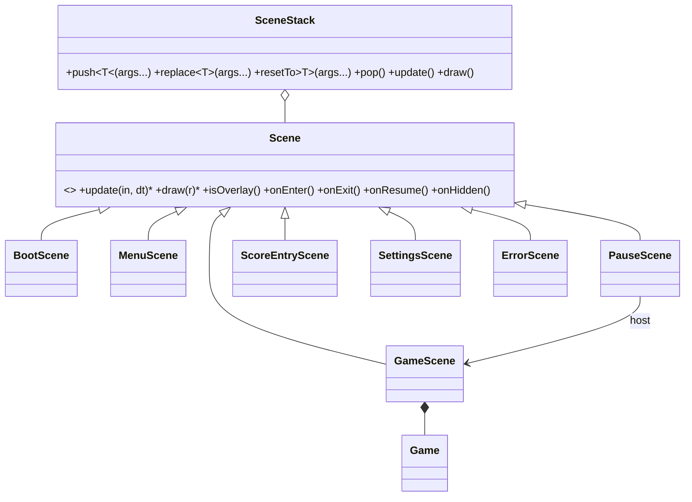
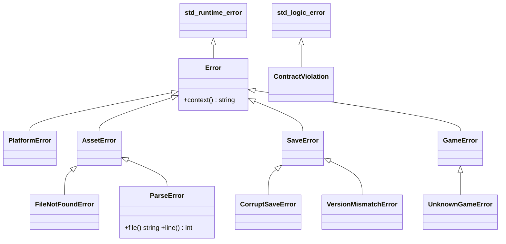
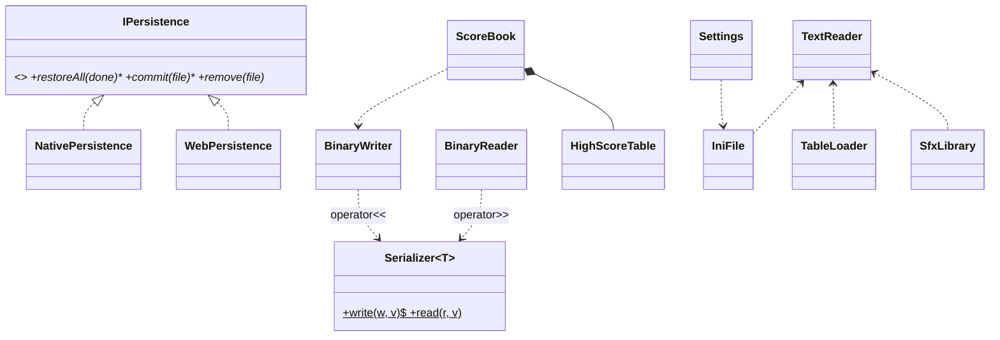

# Class diagrams

## Games

```mermaid
classDiagram
    class Game {
        <<abstract>>
        +step(in, dt)
        +render(r)
        +info()* GameInfo
        +reset()*
        +isOver()* bool
        +score()* uint32
        #handleInput(in)*
        #updateWorld(dt)*
        #drawWorld(r)*
        #drawHud(r)
        -liveInstances_$ int
    }
    class GridGame {
        <<abstract>>
        #cellToScreen(cell)
        #screenToCell(lcd)
        #drawFrame(r)
    }
    class PhysicsGame {
        <<abstract>>
        #updateWorld(dt) final
        #simulate(subDt)*
        #objects_ vector~unique_ptr~GameObject~~
        #camera_ Camera
    }
    class Counted~T~ {
        +alive()$ int
    }
    Game <|-- GridGame
    Game <|-- PhysicsGame
    GridGame <|-- SerpentGame
    GridGame <|-- MinefieldGame
    GridGame <|-- StackfallGame
    PhysicsGame <|-- FlapwingGame
    PhysicsGame <|-- SilverballGame
    Counted <|-- SerpentGame : private
    Counted <|-- MinefieldGame : private
    Rules <|.. SilverballGame
    GameRegistry ..> Game : creates
```

## Game objects (the diamond)

```mermaid
classDiagram
    class Identifiable { +id() int  +debugName() }
    class IUpdatable { <<interface>> +update(dt)* }
    class IDrawable { <<interface>> +draw(r)* }
    Identifiable <|-- IUpdatable : virtual
    Identifiable <|-- IDrawable : virtual
    IUpdatable <|-- GameObject
    IDrawable <|-- GameObject
    GameObject <|-- Bird
    GameObject <|-- ParallaxLayer
    GameObject <|-- Ball
    GameObject <|-- TableElement
    TableElement <|-- Wall
    TableElement <|-- Bumper
    TableElement <|-- Slingshot
    TableElement <|-- DropTarget
    TableElement <|-- Rollover
    TableElement <|-- Flipper
    TableElement <|-- Plunger
    TableElement *-- Collider : owns
```

## Colliders

```mermaid
classDiagram
    class Collider { <<abstract>> +test(ball)* optional~Contact~ }
    Collider <|-- CircleCollider
    Collider <|-- SegmentCollider
    SegmentCollider <|-- FlipperCollider
    class FlipperCollider { +setAngle(angle, angularVel) }
```

## Scenes

```mermaid
classDiagram
    class Scene { <<abstract>> +update(in, dt)* +draw(r)* +isOverlay() +onEnter() +onExit() +onResume() +onHidden() }
    class SceneStack { +push~T~(args...) +replace~T~(args...) +resetTo~T~(args...) +pop() +update() +draw() }
    SceneStack o-- Scene
    Scene <|-- BootScene
    Scene <|-- MenuScene
    Scene <|-- GameScene
    Scene <|-- PauseScene
    Scene <|-- ScoreEntryScene
    Scene <|-- SettingsScene
    Scene <|-- ErrorScene
    GameScene *-- Game
    PauseScene --> GameScene : host
```

## Exceptions

```mermaid
classDiagram
    std_runtime_error <|-- Error
    std_logic_error <|-- ContractViolation
    Error <|-- PlatformError
    Error <|-- AssetError
    AssetError <|-- FileNotFoundError
    AssetError <|-- ParseError
    Error <|-- SaveError
    SaveError <|-- CorruptSaveError
    SaveError <|-- VersionMismatchError
    Error <|-- GameError
    GameError <|-- UnknownGameError
    class Error { +context() string }
    class ParseError { +file() string +line() int }
```

## Files and persistence

```mermaid
classDiagram
    class IPersistence { <<interface>> +restoreAll(done)* +commit(file)* +remove(file)* }
    IPersistence <|.. NativePersistence
    IPersistence <|.. WebPersistence
    class Serializer~T~ { +write(w, v)$ +read(r, v)$ }
    BinaryWriter ..> Serializer : operator<<
    BinaryReader ..> Serializer : operator>>
    ScoreBook *-- HighScoreTable
    ScoreBook ..> BinaryWriter
    Settings ..> IniFile
    TextReader <.. IniFile
    TextReader <.. TableLoader
    TextReader <.. SfxLibrary
```
